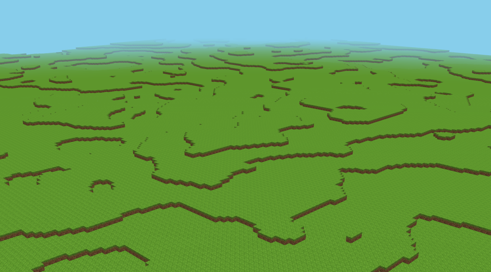

<h1 align="center">Torq</h1>

<p align="center">
  
</p>

Torq is a C++20/OpenGL voxel terrain prototype focused on fast chunk streaming, optimized chunk meshing, and responsive first-person block interaction. The game currently generates grass terrain, streams chunks around the player, supports collision-aware movement, and lets you place/delete blocks in real time.

## Highlights

- Procedural voxel terrain with chunk streaming around the player/camera.
- Chunk cache plus region-backed persistence for generated and edited chunks.
- Worker-thread chunk loading, meshing, and persistence.
- Neighbor-aware greedy meshing to reduce hidden faces and mesh size.
- Frustum culling, fog, and simple sun/ambient lighting.
- First-person physics controller with gravity, jump, and block collision.
- Runtime block deletion and grass-block placement.
- Optional no-collision free camera mode for debugging/exploration.

## Build Requirements

- Linux desktop with an OpenGL-capable GPU/driver
- CMake 3.17 or newer
- C++20 compiler, such as GCC or Clang
- Zlib development package
- OpenGL development package
- X11 development packages for the vendored GLFW build

On Ubuntu/Debian:

```bash
sudo apt update
sudo apt install build-essential cmake pkg-config libgl1-mesa-dev zlib1g-dev xorg-dev
```

The normal checkout vendors `glad`, `glfw`, `glm`, `stb_image`, and `noise` under `lib/`.

## Quick Start

Configure and build an optimized release binary:

```bash
cmake -S . -B build-release -DCMAKE_BUILD_TYPE=Release
cmake --build build-release -j"$(nproc)"
```

Run the game:

```bash
./torq
```

CMake writes the executable to the repository root.

For a debug build:

```bash
cmake -S . -B build -DCMAKE_BUILD_TYPE=Debug
cmake --build build -j"$(nproc)"
./torq
```

## Controls

| Input | Action |
| --- | --- |
| `W`, `A`, `S`, `D` | Move |
| `Space` | Jump |
| `Left Shift` | Descend/crouch input |
| Hold left mouse + move mouse | Look around |
| Mouse wheel | Zoom/FOV |
| Right mouse button | Place grass block |
| `R` | Delete targeted block |
| `Esc` | Quit |

## Useful Knobs

Most gameplay/debug tuning is still intentionally simple and lives in code:

| Location | Setting |
| --- | --- |
| `main.cpp` | Set `freeCameraMode = false` for physics/player mode, or `true` for no-collision free camera mode |
| `main.cpp` | Set `printFPS = true` to print FPS once per second, or `false` to disable it |
| `main.cpp` | `chunkCacheConfig.render_distance`: render distance in chunks |
| `main.cpp` | `chunkCacheConfig.active_radius`: active/editable resident radius |
| `include/player_controller.h` | `WALK_SPEED`, `JUMP_SPEED`, `GRAVITY` |

## Project Shape

```text
include/          Public engine/game headers
src/resources/    Chunk cache, renderer, meshing, worker integration
src/physics/      Player physics and collision
src/IO/           Window, keyboard, mouse, and camera helpers
src/worldgen/     Terrain generation
assets/           Shaders and textures
cache/            Generated runtime chunk/cache data
```

## Generated Data

Torq writes runtime chunk data under `cache/`. Build outputs, cache files, and generated terrain artifacts are not part of the source of truth.
